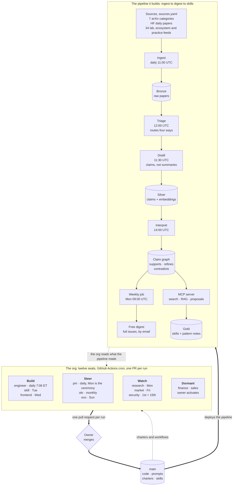
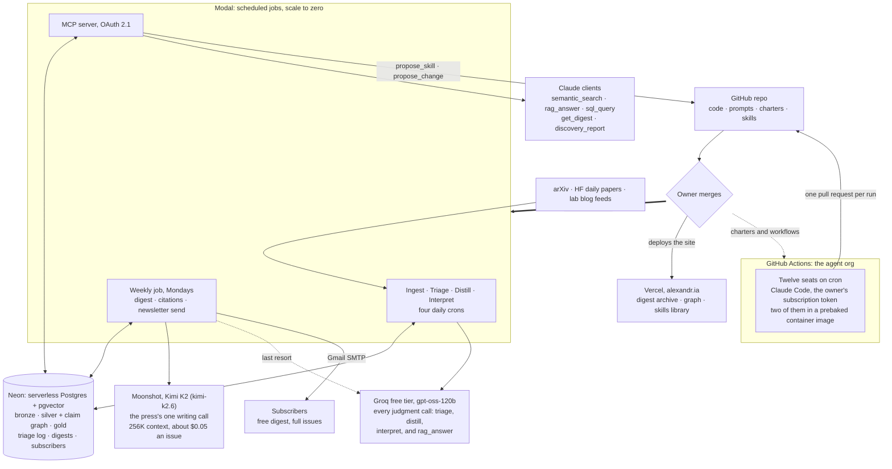

# alexandria

**Accelerate every builder to frontier speed.**

alexandria reads the moving frontier of AI research every day and turns it into
things an agent can load: skills, pattern notes, a claim graph, and a weekly
digest. The terminal state of a paper is never "read." It is a **skill**, a
**pattern note**, or a **discard**. A paper that does not eventually change how
an agent is built was, for this system's purposes, noise.

Two layers make that happen, and both of them run themselves.

1. **The pipeline** reads, triages, distills, connects, and publishes. It runs
   on crons over one Postgres database, with no worker ever calling another.
2. **The agent org** builds and steers the pipeline. Twelve agent seats run on
   GitHub Actions schedules, each with a versioned charter, each shipping one
   pull request per run. The owner's merge is the only thing that takes effect.

The recursion is the point. The org ships the pipeline, the pipeline feeds the
org, and the owner sits on the single gate between a proposal and reality.

It is also a course in **AI systems architecture**, taught bottom-up by
building: infrastructure, models, data, orchestration, agents, plus RAG, MCP,
skills, memory, and the engineering stack of context, harness, and loop.
[docs/curriculum.md](docs/curriculum.md) maps every layer to the exact place in
this repo where it was learned.

## Architecture

Both layers in one view, read top to bottom. The org proposes, the owner merges,
the merge deploys the pipeline, and the pipeline produces what the org reads next
week. That circle is the whole company.



The planning hierarchy above the seats is four levels deep, and every agent is
measured against it in that order: the **mission** in
[vision.md §0](docs/vision.md), the quarterly **OKRs** in
[docs/okrs/](docs/okrs/), the weekly **sprint** in [docs/sprints/](docs/sprints/),
and the **day's** work in each seat's run. When they conflict, the higher level
wins, and the owner's recorded words outrank any charter that has drifted from
them.

### Layer 1: the data model

The pipeline follows the **medallion architecture**, borrowed from the lakehouse
world.

| Layer | Contents | Written by |
|---|---|---|
| Bronze | Raw papers, abstracts, source metadata | Ingest job |
| Silver | Distilled claims. The unit of knowledge is the *claim*, not the paper | Distill job |
| Gold | Promoted assets: skill files, pattern notes | Owner approval only |

Two loops run over this data.

1. **The reading loop**, daily into weekly: ingest, triage, distill, interpret,
   then the Monday digest.
2. **The recursive loop**, weekly: the research seat reads the triage log (the
   eval set, since every decision is recorded with its reasoning and human
   verdicts label it) plus newly distilled claims, and proposes diffs to the
   system's own prompts and sources **as pull requests**. The system never
   modifies itself autonomously. The human merge is the gate.

### Layer 2: the seats

Full detail in [docs/agents/org-chart.md](docs/agents/org-chart.md), charters in
[prompts/](prompts/), workflows in [.github/workflows/](.github/workflows/), and
the decision behind each seat in [docs/decisions.md](docs/decisions.md).

| Seat | Cadence | Lane | ADR |
|---|---|---|---|
| engineer | daily 7:06 ET | product code and the pipeline | ADR-14 |
| pm | daily 6:35 ET standup, Mon is the ceremony | sprints, backlog, board, org chart, and the daily run-health and delivery-health report | ADR-15 |
| research | Mon 16:30 UTC | what deserves reading: digest review, curation brief, sources, meta-review | ADR-25 |
| skill | Tue 8:00 ET | the gold production line in skills/ | ADR-22 |
| frontend | Wed 8:00 ET | the site, verified visually from screenshots, and setting approved copy rather than writing it | ADR-23 |
| market | Fri 7:00 ET | the outside view in docs/market/ | ADR-17 |
| writer | daily, after the digest | the words as a craft: docs/voice/, the digest prompt, and drafting the site's copy | ADR-28 |
| exo | Sun 10:00 ET | the org itself: charters, workflows, this README | ADR-19 |
| security | 1st and 15th | debug sweeps and defensive audits | ADR-20 |
| okr | monthly | quarterly objectives and purpose drift | ADR-16 |
| finance | dormant | OPEX today, unit economics after launch | ADR-24 |
| sales | dormant | campaigns and drafts, never sends | ADR-24 |

Every seat runs the same shape. A GitHub Actions cron checks out this repo,
runs Claude Code headlessly against the seat's charter file, and the run ends
with one branch and one pull request. No agent merges its own work, no agent
pushes to main, and no agent touches secrets. The harness is the same for every
seat and the model behind it is not. All twelve run on Claude today. From
2026-09-19 to 2026-09-23 the pm, market, okr and finance seats were routed to
an open model through a third-party endpoint, which is
[model routing](docs/agents/model-routing.md) lever 2. That trial is paused: it
failed the PM seat twice and the routing secrets were removed, so the four
seats fall back to Sonnet. The workflows still hold the routed step, and the
conditions for turning it back on are in
[the incident register](docs/agents/incidents.md) under incident 23. Two modes govern when they run:
**asynchronous**, where the schedules are the heartbeat, and **synchronous**,
where the owner is present and seats are dispatched into her session.

The org keeps its own memory in [docs/agents/](docs/agents/), because every run
starts with a fresh context and remembers nothing: the
[learning log](docs/agents/learning-log.md) for what each ExO cycle found, the
[incident register](docs/agents/incidents.md) for runs that failed or shipped
nothing, [model routing](docs/agents/model-routing.md) for which seat gets which
model, [turn caps](docs/agents/turn-caps.md) for how much room each seat is
given to work, measured from run logs rather than guessed, and the
[register map](docs/agents/registers.md), which says for every rule the org
keeps where that rule is actually checked before something ships.

## Deployment view

The logical diagram above survives any vendor swap. This one names the vendors.



## Stack

| Concern | Choice | Why |
|---|---|---|
| Compute | [Modal](https://modal.com), scheduled functions, scale to zero | Per-second billing matches a system that works minutes per day, and free credits cover it entirely |
| Database | [Neon](https://neon.tech), serverless Postgres + pgvector | Scale to zero, and one DB holds vectors *and* structured data, so hybrid queries are single statements |
| Judgment models | `openai/gpt-oss-120b` via Groq free tier, for triage, distill, interpret, and RAG | Won the blind distill bake-off 4-1-3, open, $0, with 10x headroom over our volume |
| The press's model | `kimi-k2.6` via [Moonshot](https://platform.kimi.ai), for the weekly issue and nothing else (ADR-32) | The corpus crons have small prompts and fit a free tier. The issue does not: it needs 36,000 tokens in one request and Groq's free tier caps one at 8,000. Kimi gives it 256K of context on a prepaid account for about $0.05 an issue, and the weights are open, so the destination is serving it ourselves |
| Embeddings | Qwen3-Embedding-0.6B, in-process on Modal | Top open family on MTEB, and batch jobs need no serving endpoint |
| Interactive search | MCP tools over Postgres: `semantic_search`, `rag_answer`, `sql_query`, `get_digest`, `discovery_report`, `propose_skill`, `propose_change` | Agentic retrieval for humans and agents, hardwired retrieval for batch |
| Agent org | GitHub Actions cron + `anthropics/claude-code-action`, on the owner's existing subscription token | Actions minutes are free on a public repo, so the org's heartbeat costs nothing and does not depend on a laptop being open (ADR-18) |
| Site | Next.js on Vercel | Static-first, and the same repo the agents already work in |
| Code, prompts, charters, gold | This repo | Prompts and charters are versioned files, so self-improvement proposals are literal git diffs |

Standing cost: **$0/month**, for the pipeline and the org together. See
[docs/decisions.md](docs/decisions.md) for every architectural decision and the
reasoning behind it, and [docs/stack.md](docs/stack.md) for what each binding
becomes at industrial scale.

## The product

Decided 2026-09-17 and 2026-09-18, and recorded in [vision.md §0](docs/vision.md).

- **The weekly digest is free**, in full, with no paywalled sections. It is the
  acquisition engine and the human interface, not the product.
- **The paid spine is $20 a month**: the operational layer that a builder's
  agents actually load, which means the skills library, the claim graph, and
  agentic retrieval over the corpus.
- **Launch is 2026-10-13**, a dated event in the Scrum sense, then continuous
  updates after it. The business is meant to be profitable at launch.

The benchmark is explicit. The digest is measured monthly against the TLDR AI
and Import AI class, and the library against the Elicit and Consensus class, on
judgment, speed to the frontier, and actionability.

## Layout

```
db/schema.sql             bronze / silver / gold tables + triage log (the eval set)
pipeline/                 Modal apps: ingest, triage, distill, interpret, weekly
mcp/server.py             the MCP server: search, RAG, digest, proposal tools
site/                     Next.js site: digest archive, claim graph, skills library
sources.yaml              the read list, tiered a/a-low/b/c/d as triage priors
prompts/                  two kinds of versioned prompt, both proposed against by diff:
                            pipeline prompts (triage, distill, interpret, digest, rag-answer)
                            agent charters (*-agent.md), one per seat
.github/workflows/        agent-*.yml, one scheduled workflow per seat
skills/                   the gold layer: promoted skills and pattern notes
docs/vision.md            the mission and the declared end state
docs/decisions.md         architecture decision records, ADR-1 through ADR-28
docs/diagrams.md          the diagram atlas: pipeline status, blackboard, org, agent loop
docs/agents/              the org's memory: org chart, learning log, incidents, register map, model routing, turn caps
docs/okrs/                quarterly objectives and key results
docs/sprints/             the weekly sprint, one file per sprint
docs/backlog.md           the consolidated board, every seat's proposals in one order
docs/ideas.md             the ideas ledger: agents append, only the owner writes verdicts
docs/allhands/            minutes of the owner's all-hands, and the directives they set
docs/security/            audit reports from the security seat
docs/market/              landscape, positioning, and the outside view
docs/product/             design writeups for what is being built next
docs/curriculum.md        the AI systems stack, layer by layer, learned by building
```

## Status

The pipeline, built bottom-up.

- [x] Architecture designed (see decisions doc)
- [x] Repo scaffold, schema, ingest job
- [x] Neon database provisioned, schema applied
- [x] Tiered sources (sources.yaml), daily ingest cron live
- [x] Triage job live: gpt-oss-120b via Groq, batched, rate-limit-aware
- [x] Claim graph schema + interpret worker (edges: supports/refines/contradicts/duplicates)
- [x] Distill job live: bake-off winner gpt-oss-120b + Qwen3 embeddings, daily 11:30 UTC
- [x] First claims in silver, first edges in the claim graph
- [x] Weekly digest live: three sections (trailblazing / gaining traction / left behind),
      first edition 2026-W37, written to the `digests` table as the record
- [x] The press writes on Kimi K2 (ADR-32), with the Groq free tier behind it as a
      last resort, a model-availability check at deploy and at run start, and an
      email to the owner on every path that ends without an issue (incident 24)
- [x] Slow loop: citation tracking via Semantic Scholar, merged into the weekly cron (ADR-8)
- [x] MCP server live (ADR-11): OAuth 2.1, semantic_search / rag_answer / sql_query /
      get_digest / discovery_report / propose_skill / propose_change, at
      ap4509--alexandria-mcp-serve.modal.run
- [x] RAG (retrieve-then-generate, ADR-20): `rag_answer` synthesizes cited answers
      over the claim corpus. A hosted, paid surface is still a ledger proposal
- [x] Newsletter live (phase 1): subscribers table, Monday cron emails each issue
      itself, first send 2026-09-11. Email only, and digests never enter the repo
- [ ] **The press is currently silent.** The last issue written is 2026-W37
      (2026-09-14). No model on the provider's free tier can print the weekly
      issue at the current prompt size, so the fix is a shorter generator prompt
      or an issue split across several requests. Availability checks, an ordered
      fallback list and an alarm to the owner are in flight. Incident 24 has the
      diagnosis and [delivery health](docs/agents/delivery-health.md) has the
      standing guardrails
- [x] Gold layer open: first skills merged, `harness-engineering` (2026-09-12) and
      `self-improving-post-training-loops` (2026-09-18), each carrying claim-id
      provenance and paper citations
- [ ] ADR-13 reviewer panel (provenance, adversary, validator) as the gate on gold.
      Until it exists, the owner's merge is that gate
- [ ] Meta-review recursive loop running on its own cadence. The `propose_change`
      tool is live and the research seat owns the loop (ADR-25), with its first
      scheduled run on 2026-09-21
- [ ] Upgrade the judgment model beyond free tiers when budget allows (a bake-off decides
      if it is needed)

The org, built after it (ADR-14 through ADR-28, all in one week of September 2026).

- [x] Agent org live in the cloud, not on a laptop (ADR-18): twelve seats, ten on cron,
      each a GitHub Actions workflow running its charter
- [x] Seats run in a prebaked container image (`.github/docker/Dockerfile`), so a run
      spends its first minutes working rather than installing. Frontend and engineer
      migrated; the rest follow
- [x] Charters versioned in prompts/, one file per seat, owner-merged like any code
- [x] ExO loop live (ADR-19): the org reviews and improves the org, weekly
- [x] Org memory in docs/agents/: org chart, learning log, incident register, register map,
      model routing, turn caps, the runtime-change law
- [x] Planning hierarchy live: mission, Q4 OKRs, weekly sprints, daily runs
- [ ] First curation brief from the research seat (ADR-25) merged into
      docs/research/briefs/. The seat has now run and the first brief is in review
- [ ] One shared GitHub App identity for the seats (ADR-27), which is what lets a seat
      fix its own machinery. `APP_ID` is set; the private key is pending
- [ ] GitHub Projects board reconciled automatically by the PM seat, which waits on the
      owner-created `PROJECTS_TOKEN`
- [ ] Finance and sales seats activated (ADR-24), which is a one-line schedule change each.
      Both have now run once on dispatch

The launch, 2026-10-13. Tracked in [docs/backlog.md](docs/backlog.md).

- [ ] Site deployed on Vercel with real content in the digest archive
- [ ] Email capture live before Stripe exists
- [ ] Stripe account, keys, and the $20 spine wired to payment
- [ ] Pricing and gating on the site match free digest plus $20 spine
