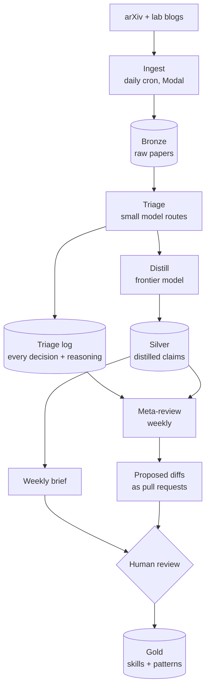
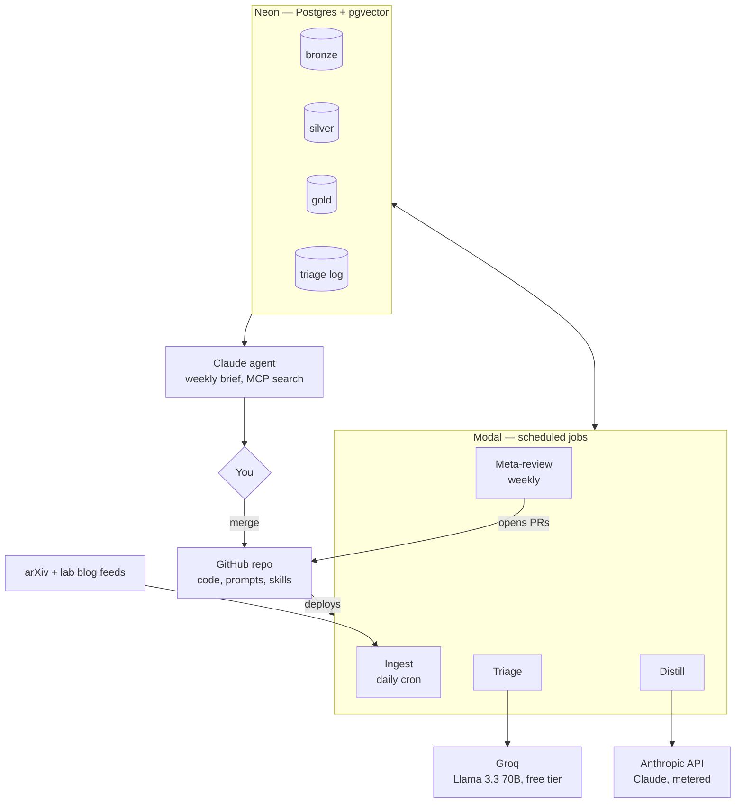

# alexandria

A self-evolving pipeline that stays current on AI research and converts what it reads into
operational assets — skills, context-engineering patterns, and agentic loop designs.

The terminal state of a paper is never "read." It is a **skill**, a **pattern note**, or a
**discard**. A paper that doesn't eventually change how an agent is built was, for this
system's purposes, noise.

It is also a systems-architecture course taught by building: the two disciplines under
study are **harness engineering** (the deterministic scaffolding around stochastic model
calls) and **loop engineering** (what repeats, on what clock, with how much autonomy, and
where the human gate sits). [docs/curriculum.md](docs/curriculum.md) maps each concept to
the exact place in this repo where it is instantiated.

## Architecture



The data model follows the **medallion architecture** (borrowed from the lakehouse world):

| Layer | Contents | Written by |
|---|---|---|
| Bronze | Raw papers, abstracts, source metadata | Ingest job |
| Silver | Distilled claims — the unit of knowledge is the *claim*, not the paper | Distill job |
| Gold | Promoted assets: skill files, pattern notes | Human approval only |

Two loops run over this data:

1. **The pipeline loop** (daily/weekly): ingest → triage → distill → brief → human promotion.
2. **The recursive loop** (weekly): the meta-review reads the triage log (the eval set — every
   decision is recorded with its reasoning, and human verdicts label it) plus newly distilled
   claims, and proposes diffs to the system's own prompts and pipeline **as pull requests**.
   The system never modifies itself autonomously; the human merge is the gate.

## Deployment view

The logical diagram above survives any vendor swap; this one names the vendors.



## Stack

| Concern | Choice | Why |
|---|---|---|
| Compute | [Modal](https://modal.com) — scheduled functions, scale to zero | Per-second billing matches a system that works minutes per day; free credits cover it entirely |
| Database | [Neon](https://neon.tech) — serverless Postgres + pgvector | Scale-to-zero; one DB holds vectors *and* structured data, so hybrid queries are single statements |
| Triage model | Llama 3.3 70B via Groq free tier | Open model, $0, 10× headroom over our volume |
| Distill model | Claude (Anthropic API) | Frontier reasoning where quality matters; the only metered cost (~$1–2/mo) |
| Embeddings | Qwen3-Embedding-0.6B, in-process on Modal | Top open family on MTEB; batch jobs need no serving endpoint |
| Interactive search | MCP tools over Postgres (`semantic_search` + `sql_query`) | Agentic retrieval for humans; hardwired retrieval for batch |
| Code, prompts, gold | This repo | Prompts are versioned files, so self-improvement proposals are literal git diffs |

Standing cost: **$0/month**. See [docs/decisions.md](docs/decisions.md) for every
architectural decision and the reasoning behind it.

## Layout

```
db/schema.sql        bronze / silver / gold tables + triage log (the eval set)
pipeline/            Modal apps: ingest, triage, distill, meta-review
prompts/             versioned prompts — the recursive loop proposes diffs against these
skills/              the gold layer: promoted skills and pattern notes
docs/decisions.md    architecture decision records
docs/curriculum.md   what the architecture teaches: harness + loop engineering
```

## Status

- [x] Architecture designed (see decisions doc)
- [x] Repo scaffold, schema, ingest job
- [x] Neon database provisioned, schema applied
- [x] Tiered sources (sources.yaml), daily ingest cron live
- [x] Triage job live: gpt-oss-120b via Groq, batched, rate-limit-aware
- [x] Claim graph schema + interpret worker (edges: supports/refines/contradicts/duplicates)
- [x] Distill job live: bake-off winner gpt-oss-120b + Qwen3 embeddings, daily 11:30 UTC
- [x] First claims in silver, first edges in the claim graph
- [ ] Upgrade distill model beyond free tiers when budget allows (bake-off decides if it's needed)
- [ ] Weekly brief + promotion flow
- [ ] Meta-review recursive loop
- [ ] Digest retrospectives: matured / deprecated sections (ADR-8)
- [ ] Slow loop: citation check on aged index-tier papers (Semantic Scholar)
