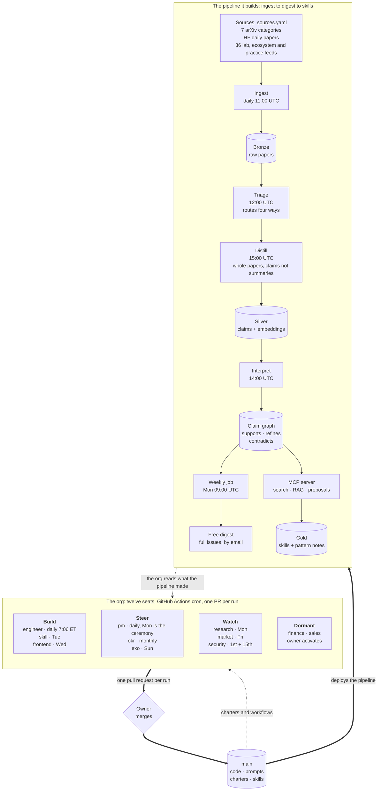
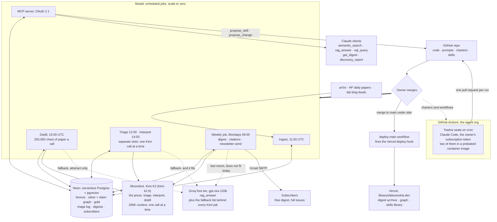

# alexandria

**Accelerate every builder to frontier speed.**

alexandria reads the moving frontier of AI research every day and turns it into
things an agent can load: skills, pattern notes, a claim graph, and a weekly
digest. The terminal state of a paper is never "read." It is a **skill**, a
**pattern note**, or a **discard**. A paper that does not eventually change how
an agent is built was, for this system's purposes, noise.

Two layers make that happen, and both of them run themselves.

1. **The pipeline** reads, triages, distills, connects, and publishes. It runs
   on crons over one Postgres database, with no worker ever calling another.
2. **The agent org** builds and steers the pipeline. Twelve agent seats run on
   GitHub Actions schedules, each with a versioned charter, each shipping one
   pull request per run. The owner's merge is the only thing that takes effect.

The recursion is the point. The org ships the pipeline, the pipeline feeds the
org, and the owner sits on the single gate between a proposal and reality.

It is also a course in **AI systems architecture**, taught bottom-up by
building: infrastructure, models, data, orchestration, agents, plus RAG, MCP,
skills, memory, and the engineering stack of context, harness, and loop.
[docs/curriculum.md](docs/curriculum.md) maps every layer to the exact place in
this repo where it was learned.

## Architecture

Both layers in one view, read top to bottom. The org proposes, the owner merges,
the merge deploys the pipeline, and the pipeline produces what the org reads next
week. That circle is the whole company.


```mermaid
flowchart TB
    subgraph ORG["The org: twelve seats, GitHub Actions cron, one PR per run"]
        direction TB
        BUILD["<b>Build</b><br/>engineer · daily 7:06 ET<br/>skill · Tue<br/>frontend · Wed"]
        STEER["<b>Steer</b><br/>pm · daily, Mon is the ceremony<br/>okr · monthly<br/>exo · Sun"]
        WATCH["<b>Watch</b><br/>research · Mon<br/>market · Fri<br/>security · 1st + 15th"]
        DORM["<b>Dormant</b><br/>finance · sales<br/>owner activates"]
    end

    subgraph PIPE["The pipeline it builds: ingest to digest to skills"]
        direction TB
        SRC["Sources, sources.yaml<br/>7 arXiv categories<br/>HF daily papers<br/>36 lab, ecosystem and practice feeds"]
        ING["Ingest<br/>daily 11:00 UTC"]
        BR[("Bronze<br/>raw papers")]
        TRI["Triage<br/>12:00 UTC<br/>routes four ways"]
        DIS["Distill<br/>15:00 UTC<br/>whole papers, claims not summaries"]
        SIL[("Silver<br/>claims + embeddings")]
        INT["Interpret<br/>14:00 UTC"]
        GR[("Claim graph<br/>supports · refines<br/>contradicts")]
        WK["Weekly job<br/>Mon 09:00 UTC"]
        DIGEST["Free digest<br/>full issues, by email"]
        MCP["MCP server<br/>search · RAG · proposals"]
        GOLD[("Gold<br/>skills + pattern notes")]

        SRC --> ING --> BR --> TRI --> DIS --> SIL --> INT --> GR
        GR --> WK --> DIGEST
        GR --> MCP --> GOLD
    end

    ORG ==>|"one pull request per run"| GATE{"Owner<br/>merges"}
    GATE ==> MAIN[("main<br/>code · prompts<br/>charters · skills")]
    MAIN ==>|"deploys the pipeline"| PIPE
    MAIN -.->|"charters and workflows"| ORG
    PIPE -.->|"the org reads what the pipeline made"| ORG
```

The planning hierarchy above the seats is four levels deep, and every agent is
measured against it in that order: the **mission** in
[vision.md §0](docs/vision.md), the quarterly **OKRs** in
[docs/okrs/](docs/okrs/), the weekly **sprint** in [docs/sprints/](docs/sprints/),
and the **day's** work in each seat's run. When they conflict, the higher level
wins, and the owner's recorded words outrank any charter that has drifted from
them.

### Layer 1: the data model

The pipeline follows the **medallion architecture**, borrowed from the lakehouse
world.

| Layer | Contents | Written by |
|---|---|---|
| Bronze | Raw papers, abstracts, source metadata | Ingest job |
| Silver | Distilled claims. The unit of knowledge is the *claim*, not the paper | Distill job |
| Gold | Promoted assets: skill files, pattern notes | Owner approval only |

Two loops run over this data.

1. **The reading loop**, daily into weekly: ingest, triage, distill, interpret,
   then the Monday digest.
2. **The recursive loop**, weekly: the research seat reads the triage log (the
   eval set, since every decision is recorded with its reasoning and human
   verdicts label it) plus newly distilled claims, and proposes diffs to the
   system's own prompts and sources **as pull requests**. The system never
   modifies itself autonomously. The human merge is the gate.

### Layer 2: the seats

Full detail in [docs/agents/org-chart.md](docs/agents/org-chart.md), charters in
[prompts/](prompts/), workflows in [.github/workflows/](.github/workflows/), and
the decision behind each seat in [docs/decisions.md](docs/decisions.md).

| Seat | Cadence | Lane | ADR |
|---|---|---|---|
| engineer | twice daily, 7:06 and 19:06 ET | product code and the pipeline | ADR-14 |
| pm | daily 6:35 ET standup, Mon is the ceremony | sprints, backlog, board, org chart, and the daily run-health and delivery-health report | ADR-15 |
| research | Mon 16:30 UTC | what deserves reading: digest review, curation brief, sources, meta-review | ADR-25 |
| skill | Tue 8:00 ET | the gold production line in skills/ | ADR-22 |
| frontend | Wed 8:00 ET | the site, verified visually from screenshots, and setting approved copy rather than writing it | ADR-23 |
| market | Fri 7:00 ET | the outside view in docs/market/ | ADR-17 |
| writer | daily, after the digest | the words as a craft: docs/voice/, the digest prompt, and drafting the site's copy | ADR-28 |
| exo | Sun 10:00 ET | the org itself: charters, workflows, this README | ADR-19 |
| security | 1st and 15th | debug sweeps and defensive audits | ADR-20 |
| okr | monthly | quarterly objectives and purpose drift | ADR-16 |
| finance | dormant | OPEX today, unit economics after launch | ADR-24 |
| sales | dormant | campaigns and drafts, never sends | ADR-24 |

Every seat runs the same shape. A GitHub Actions cron checks out this repo,
runs Claude Code headlessly against the seat's charter file, and the run ends
with one branch and one pull request. No agent merges its own work, no agent
pushes to main, and no agent touches secrets. The harness is the same for every
seat and the model behind it is not. All twelve run on Claude today. From
2026-09-19 to 2026-09-23 the pm, market, okr and finance seats were routed to
an open model through a third-party endpoint, which is
[model routing](docs/agents/model-routing.md) lever 2. That trial is paused: it
failed the PM seat twice and the routing secrets were removed, so the four
seats fall back to Sonnet. The workflows still hold the routed step, and it is
now a real fallback rather than an either/or: since 2026-09-24 the open-routed
step may fail without failing the job, and the Claude step runs whenever it does
not succeed. That was the precondition for turning the trial back on, and the
remaining conditions are in
[the incident register](docs/agents/incidents.md) under incident 23. Two modes govern when they run:
**asynchronous**, where the schedules are the heartbeat, and **synchronous**,
where the owner is present and seats are dispatched into her session.

The org keeps its own memory in [docs/agents/](docs/agents/), because every run
starts with a fresh context and remembers nothing: the
[learning log](docs/agents/learning-log.md) for what each ExO cycle found, the
[incident register](docs/agents/incidents.md) for runs that failed or shipped
nothing, [model routing](docs/agents/model-routing.md) for which seat gets which
model, [turn caps](docs/agents/turn-caps.md) for how much room each seat is
given to work, measured from run logs rather than guessed, and the
[register map](docs/agents/registers.md), which says for every rule the org
keeps where that rule is actually checked before something ships, and
[quality claims](docs/agents/quality-claims.md), which lists every claim the
public site makes about what we ship beside the machine that would have to
run for it to be true.

## Deployment view

The logical diagram above survives any vendor swap. This one names the vendors.


```mermaid
flowchart TB
    FEEDS["arXiv · HF daily papers · lab blog feeds"]
    NEON[("Neon: serverless Postgres + pgvector<br/>bronze · silver + claim graph · gold<br/>triage log · digests · subscribers")]
    GROQ["Groq free tier, gpt-oss-120b<br/>rag_answer<br/>plus the fallback list behind every Kimi job"]
    KIMI["Moonshot, Kimi K2 (kimi-k2.6)<br/>the press, triage, interpret, distill<br/>256K context, one call at a time"]

    subgraph MODAL["Modal: scheduled jobs, scale to zero"]
        direction TB
        INGEST["Ingest, 11:00 UTC"]
        DISTILL["Distill, 15:00 UTC<br/>250,000 chars of paper a call"]
        DAILY["Triage 12:00 · Interpret 14:00<br/>separate slots: one Kimi call at a time"]
        WK2["Weekly job, Mondays 09:00<br/>digest · citations · newsletter send"]
        MCP2["MCP server, OAuth 2.1"]
    end

    subgraph GHA["GitHub Actions: the agent org"]
        SEATS["Twelve seats on cron<br/>Claude Code, the owner's subscription token<br/>two of them in a prebaked container image"]
    end

    FEEDS --> INGEST
    INGEST <--> NEON
    DISTILL <--> NEON
    DAILY <--> NEON
    WK2 <--> NEON
    MCP2 <--> NEON
    DISTILL --> KIMI
    DISTILL -.->|"fallback, abstract only"| GROQ
    DAILY --> KIMI
    DAILY -.->|"fallback, and it fits"| GROQ
    WK2 --> KIMI
    WK2 -.->|"last resort, does not fit today"| GROQ
    WK2 -->|"Gmail SMTP"| SUBS["Subscribers<br/>free digest, full issues"]
    MCP2 --> CLIENTS["Claude clients<br/>semantic_search · rag_answer · sql_query<br/>get_digest · discovery_report"]
    MCP2 -->|"propose_skill · propose_change"| GH
    SEATS -->|"one pull request per run"| GH["GitHub repo<br/>code · prompts · charters · skills"]
    GH --> OWNER{"Owner merges"}
    OWNER ==>|"deploys the jobs"| MODAL
    OWNER -->|"merge to main under site/"| HOOK["deploy-main workflow<br/>fires the Vercel deploy hook"]
    HOOK --> SITE["Vercel, libraryofalexandria.dev<br/>digest archive · graph · skills library"]
    OWNER -.->|"charters and workflows"| GHA
```

## Stack

| Concern | Choice | Why |
|---|---|---|
| Compute | [Modal](https://modal.com), scheduled functions, scale to zero | Per-second billing matches a system that works minutes per day, and free credits cover it entirely |
| Database | [Neon](https://neon.tech), serverless Postgres + pgvector | Scale to zero, and one DB holds vectors *and* structured data, so hybrid queries are single statements |
| Judgment models | `kimi-k2.6` via [Moonshot](https://platform.kimi.ai) for triage, distill and interpret, with `openai/gpt-oss-120b` on Groq's free tier behind them and for RAG | The free tier is 8,000 tokens a minute, which is two calls and then a 429 for the rest of the day, and which is less than one paper. That ceiling is the whole explanation for 4,973 untriaged papers and 164 read in full. Kimi is 262,144 tokens of context on a prepaid account, so triage finishes and distill reads the paper (ADR-2026-09-26, ADR-39). The Groq entries stay because one provider is one point of failure |
| The press's model | `kimi-k2.6` via [Moonshot](https://platform.kimi.ai), the first job to move there (ADR-32) | The corpus crons have small prompts and fit a free tier. The issue does not: it needs 36,000 tokens in one request and Groq's free tier caps one at 8,000. Kimi gives it 256K of context on a prepaid account for about $0.05 an issue, and the weights are open, so the destination is serving it ourselves |
| Embeddings | Qwen3-Embedding-0.6B, in-process on Modal | Top open family on MTEB, and batch jobs need no serving endpoint |
| Interactive search | MCP tools over Postgres: `semantic_search`, `rag_answer`, `sql_query`, `get_digest`, `discovery_report`, `propose_skill`, `propose_change` | Agentic retrieval for humans and agents, hardwired retrieval for batch |
| Agent org | GitHub Actions cron + `anthropics/claude-code-action`, on the owner's existing subscription token | Actions minutes are free on a public repo, so the org's heartbeat costs nothing and does not depend on a laptop being open (ADR-18) |
| Site | Next.js on Vercel | Static-first, and the same repo the agents already work in |
| Code, prompts, charters, gold | This repo | Prompts and charters are versioned files, so self-improvement proposals are literal git diffs |

Standing cost: **$0/month**, for the pipeline and the org together. See
[docs/decisions.md](docs/decisions.md) for every architectural decision and the
reasoning behind it, and [docs/stack.md](docs/stack.md) for what each binding
becomes at industrial scale.

## The product

Decided 2026-09-17 and 2026-09-18, and recorded in [vision.md §0](docs/vision.md).

- **The weekly digest is free**, in full, with no paywalled sections. It is the
  acquisition engine and the human interface, not the product.
- **The paid spine is $20 a month**: the operational layer that a builder's
  agents actually load, which means the skills library, the claim graph, and
  agentic retrieval over the corpus.
- **Launch is 2026-10-13**, a dated event in the Scrum sense, then continuous
  updates after it. The business is meant to be profitable at launch.

The benchmark is explicit. The digest is measured monthly against the TLDR AI
and Import AI class, and the library against the Elicit and Consensus class, on
judgment, speed to the frontier, and actionability.

## Layout

```
db/schema.sql             bronze / silver / gold tables + triage log (the eval set)
pipeline/                 Modal apps: ingest, triage, distill, interpret, weekly
mcp/server.py             the MCP server: search, RAG, digest, proposal tools
site/                     Next.js site: digest archive, claim graph, skills library
sources.yaml              the read list, tiered a/a-low/b/c/d as triage priors
prompts/                  two kinds of versioned prompt, both proposed against by diff:
                            pipeline prompts (triage, distill, interpret, digest, rag-answer)
                            agent charters (*-agent.md), one per seat
.github/workflows/        agent-*.yml, one scheduled workflow per seat
skills/                   the gold layer: promoted skills and pattern notes
docs/vision.md            the mission and the declared end state
docs/decisions.md         architecture decision records, ADR-1 through ADR-28
docs/diagrams.md          the diagram atlas: pipeline status, blackboard, org, agent loop
docs/agents/              the org's memory: org chart, learning log, incidents, register map, model routing, turn caps
docs/okrs/                quarterly objectives and key results
docs/sprints/             the weekly sprint, one file per sprint
docs/backlog.md           the consolidated board, every seat's proposals in one order
docs/board.md             the company board: the two doors onto it, and the API as it really answers
tools/board.py            the board client every seat run uses on a GitHub runner
tools/delivery_health.py  did the product reach a reader: the press, the pipeline, the deploy, the site, the MCP server
site/app/api/delivery/    the delivery receipt the command above reads, public and needing no credential
tools/graph_audit.py      the claim graph's quality, eleven metrics and a worksheet for the twelfth
docs/ideas.md             the ideas ledger: agents append, only the owner writes verdicts
docs/allhands/            minutes of the owner's all-hands, and the directives they set
docs/security/            audit reports from the security seat
docs/market/              landscape, positioning, and the outside view
docs/product/             design writeups for what is being built next
docs/curriculum.md        the AI systems stack, layer by layer, learned by building
```

## Status

The pipeline, built bottom-up.

- [x] Architecture designed (see decisions doc)
- [x] Repo scaffold, schema, ingest job
- [x] Neon database provisioned, schema applied
- [x] Tiered sources (sources.yaml), daily ingest cron live
- [x] Triage job live: batched, rate-limit-aware, tiers drained by interleaved quota
- [x] Claim graph schema + interpret worker (edges: supports/refines/contradicts/duplicates)
- [x] Distill job live: Qwen3 embeddings, daily 15:00 UTC
- [x] First claims in silver, first edges in the claim graph
- [x] Weekly digest live: three sections (trailblazing / gaining traction / left behind),
      first edition 2026-W37, written to the `digests` table as the record
- [x] The press writes on Kimi K2 (ADR-32), with the Groq free tier behind it as a
      last resort, a model-availability check at deploy and at run start, and an
      email to the owner on every path that ends without an issue (incident 24)
- [x] Slow loop: citation tracking via Semantic Scholar, merged into the weekly cron (ADR-8)
- [x] MCP server live (ADR-11): OAuth 2.1, semantic_search / rag_answer / sql_query /
      get_digest / discovery_report / propose_skill / propose_change, at
      ap4509--alexandria-mcp-serve.modal.run
- [x] RAG (retrieve-then-generate, ADR-20): `rag_answer` synthesizes cited answers
      over the claim corpus. A hosted, paid surface is still a ledger proposal
- [x] Newsletter live (phase 1): subscribers table, Monday cron emails each issue
      itself, first send 2026-09-11. Email only, and digests never enter the repo
- [ ] **The archive publishes the record, written and not yet running.** Every
      issue a reader can read reached the public because a person committed a
      markdown file under `site/content/issues/`: four commits, four times
      somebody noticed, while the Monday cron wrote its row to `digests` and
      stopped there. `site/lib/issues-live.js` makes `/library` and every issue
      route read that table, so a send is public the moment it is mailed. The
      record decides which weeks exist and a committed file still decides the
      text of any week that has one, which is why turning it on changes nothing
      that is live today. A database the site cannot read publishes exactly what
      it publishes now. This box closes on the same evidence as the box below:
      `/api/delivery` answering 200 proves the site's environment can reach
      Neon, and that is the one condition this needs
- [ ] **The press prints, and nobody outside Modal could see whether it had.**
      `2026-W39` is live on `/library` and is the newest issue a reader can read,
      checked by `python3 tools/delivery_health.py` rather than asserted. The
      long silence after `2026-W37` was a provider whose free tier could not
      print the issue at the current prompt size, and incident 24 has that
      diagnosis. What stayed broken afterwards was the watch on it: the evidence
      guardrail 4 names is the newest row in `digests` and no agent seat holds a
      credential for that table, so the question went unanswered for a week. The
      site publishes that fact at `/api/delivery` as of 2026-10-01 and the
      command reads it with no credential. Still open: this box closes when a
      run of that command reports the press green from a seat sandbox, which
      needs the receipt deployed
- [x] Gold layer open: first skills merged, `harness-engineering` (2026-09-12) and
      `self-improving-post-training-loops` (2026-09-18), each carrying claim-id
      provenance and paper citations
- [x] The library shows its receipts (2026-09-29): every skill on `/skills` states
      the date it was distilled, the claim ids behind it, and its most recent
      trigger-test result with the date and engine version, pinned by sha to the
      exact text on the page. The provenance had been in the files since
      2026-09-12 and reached no reader until today, because the frontmatter
      reader could not see an indented field
- [ ] **Skills prove themselves and revise themselves, written and not yet
      running** (ADR-36, ADR-37). `skills_needing_revision` has been in the
      schema since the founding and had never returned a row, because a skill
      reached `main` with no `promotions` row for the view to join, so seven
      deprecated claims sat there and no skill knew.
      `tools/skill_registrar.py` derives that row from each skill's own
      provenance block, `pipeline/skill_revision.py` reads the view daily and
      queues the reading and dispatches the skill seat, and
      `tools/skill_eval.py` runs each skill's tasks with and without it loaded
      on one model and prints the delta with an exact interval. Live when the
      chair applies the CI step
      ([pending-workflow-changes](docs/agents/pending-workflow-changes.md) item
      12) and deploys the daily job with a `github` secret
- [ ] **ADR-13 reviewer panel, all three reviewers built (2026-10-03).** The
      provenance reviewer is built (`tools/panel_provenance.py`) and files a
      `panel_verdicts` row per skill: the claim ids a skill cites have to exist
      in the corpus, the paper behind each one has to be in the skill's own
      citation list, and judgment the papers do not support has to say so. The
      adversary is built too (`tools/panel_adversary.py`) and asks the opposite
      question, which ADR-10's edge direction makes a query rather than a
      judgment: for every claim a skill cites, has the corpus since contradicted
      or refined it, and does the skill cite what did. A contradiction the draft
      ignored fails the skill, and a claim the interpret job never judged is
      reported by id as unmeasured, because the dangerous output here is a clean
      pass that means nobody asked the graph. Both run daily inside
      `pipeline/skill_revision.py`, so both are live when the chair deploys that
      job. Two duties are not decidable against today's format and the panel
      reports them rather than guessing: a skill cites its claim ids once for
      the whole document, so nothing says which claim supports which section,
      and nothing says whether a skill citing both sides of a contradiction
      discusses it. The validator is built as well
      (`tools/panel_validator.py`), and it needs no model key either: ADR-13
      asks whether behaviour moved in the direction the evidence supports, and
      the A/B trial is a dated receipt `tools/skill_eval.py` writes under a
      policy registered in advance, so the reviewer judges the receipt rather
      than running a trial whose threshold it would be choosing at review time.
      It asks four things of that receipt, all of them file facts: that it
      exists, that it measured the text under review rather than an earlier
      revision, that the harness's own gate passes it, and that nobody edited
      the threshold after seeing the numbers. It also holds ADR-36's own
      sentence, that a skill with no eval is `status: draft` and never
      `active`, which **fails all six skills on main today**. So the panel is
      complete and `panel_consensus`'s three passes on one text are reachable
      for the first time. **The merge is the only slice left** (a
      PR-merge-scoped token only the owner can mint), in
      docs/product/reviewer-panel.md. Until the panel passes a skill, the
      owner's merge is still the gate
- [ ] Meta-review recursive loop running on its own cadence. The `propose_change`
      tool is live and the research seat owns the loop (ADR-25), with its first
      scheduled run on 2026-09-21
- [ ] **Triage and interpret on Kimi, written and not yet deployed**
      (ADR-2026-09-26). Groq's free tier is why 4,973 papers were never triaged
      and 487 claims never linked: a run makes two calls, takes a 429, and the
      resume query makes that look like patience. Both jobs now have a fallback
      list with Moonshot at the head, a per-run spend cap measured from the
      provider's usage block, and preflight and rehearsal functions. Nothing is
      live until the chair runs the three gates and deploys; the commands are in
      each module's docstring and in the ADR
- [ ] **Distill reads the whole paper, written and not yet deployed**
      (ADR-39, owner-directed 2026-09-29). It was the last corpus job on Groq's
      free tier, where 8,000 tokens a minute is less than one paper, so it read
      12,000 characters of each one and "read in full" was true of 164 papers
      out of 8,956. It now calls Kimi through the same client triage and
      interpret use, at a 250,000-character window that takes thirteen of
      fourteen measured papers whole, ordered reading queue first, then the
      owner's four standing threads, then intake. Three ceilings stop a run and
      each names itself: money, this job's share of Moonshot's daily token
      allowance, and the clock. $0.042 a paper, ~$25 a month expected.
      Nothing is live until the chair runs the three gates and deploys; triage
      is redeployed in the same chain, because the thread list moved into
      `pipeline/priority.py` and both jobs read it

- [ ] **Reasoning-model research reaches the corpus, written and not yet
      deployed** (ADR-2026-09-26b). 209 papers in the corpus have "reasoning" in
      the title, 147 were never triaged, and of the 62 that were, 47 went to
      `index` because the old rubric rewarded a construction technique and a
      reasoning paper's contribution is usually a training recipe. The rubric and
      the `reasoning` topic are the research seat's; the code half is a closed
      claim taxonomy enforced where claims are written, a triage log that can
      hold a paper's decision history, a reasoning-first drain inside each tier,
      and a re-triage of the 47. Two reasoning feeds joined sources.yaml, which
      is bundled at deploy, so ingest is redeployed with it
- [ ] The 693 ungraded claims, backfilled. `pipeline/backfill_grades.py` is
      written, costs $0 because the grader calls no model, and is a one-time
      `modal run` the chair has not yet made
- [x] Upgrade the judgment model beyond free tiers: decided by the owner
      2026-09-25 rather than by a bake-off, because the free tier's failure was
      throughput and not quality. See ADR-2026-09-26 and docs/finance/opex.md,
      which bounds the cost at $27 a month in code

The org, built after it (ADR-14 through ADR-28, all in one week of September 2026).

- [x] Agent org live in the cloud, not on a laptop (ADR-18): twelve seats, ten on cron,
      each a GitHub Actions workflow running its charter
- [x] Seats run in a prebaked container image (`.github/docker/Dockerfile`), so a run
      spends its first minutes working rather than installing. Frontend and engineer
      migrated; the rest follow
- [x] Charters versioned in prompts/, one file per seat, owner-merged like any code
- [x] ExO loop live (ADR-19): the org reviews and improves the org, weekly
- [x] Org memory in docs/agents/: org chart, learning log, incident register, register map,
      model routing, turn caps, the runtime-change law
- [x] Planning hierarchy live: mission, Q4 OKRs, weekly sprints, daily runs
- [ ] First curation brief from the research seat (ADR-25) merged into
      docs/research/briefs/. The seat has now run and the first brief is in review
- [ ] One shared GitHub App identity for the seats (ADR-27), which is what lets a seat
      fix its own machinery. `APP_ID` is set; the private key is pending
- [ ] GitHub Projects board reconciled automatically by the PM seat. `PROJECTS_TOKEN`
      now exists and reaches every seat's run, so what remains is the reconciliation
      itself rather than the credential
- [ ] Finance and sales seats activated (ADR-24), which is a one-line schedule change each.
      Both have now run once on dispatch
- [ ] The org's output reaches main without the owner present. This is the open one that
      bounds all the others: between 2026-09-30 and 2026-10-04 the seats ran 24 times, all
      green, opened 49 pull requests and merged one, because every channel out of the org
      ends at one person. ADR/HQ decision 041 hands Tier B merges to the PM seat and is
      itself waiting in the queue. See `docs/agents/incidents.md`,
      `INC-2026-10-04-four-days-of-output-and-no-delivery`

The launch, 2026-10-13. Tracked in [docs/backlog.md](docs/backlog.md).

- [ ] Site deployed on Vercel with real content in the digest archive
- [ ] Email capture live before Stripe exists
- [ ] Stripe account, keys, and the $20 spine wired to payment
- [ ] Pricing and gating on the site match free digest plus $20 spine
