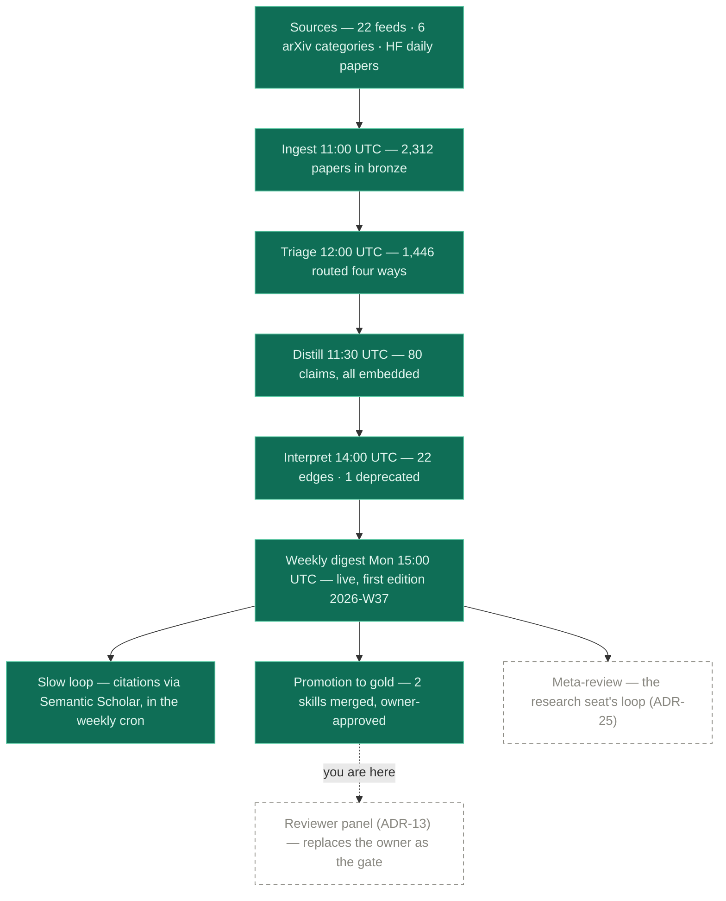
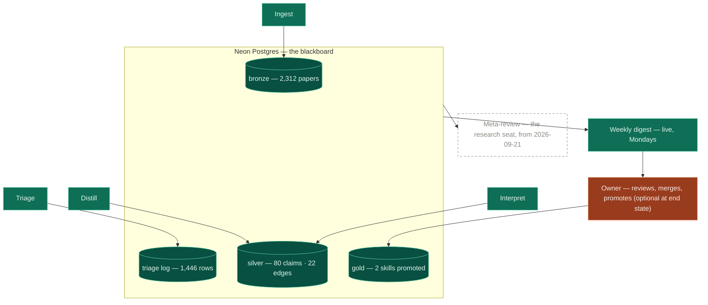
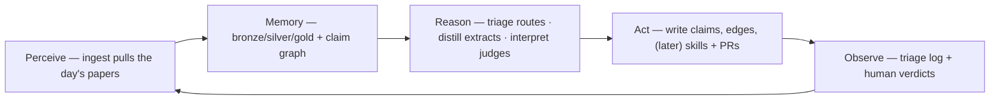
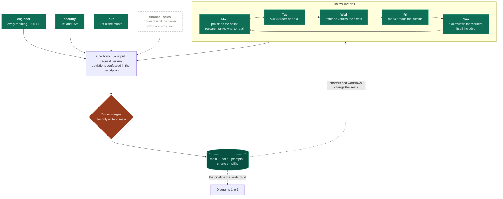

# Diagram atlas

Every architecture diagram in one place, rendered natively by GitHub. Diagrams
drawn in chat are ephemeral, and these are the durable copies. Numbers in the
status diagram are a dated snapshot, and the database is always the truth.

The system has two layers and this atlas holds both. Diagrams 1 to 3 are the
pipeline, which is what the company makes. Diagram 4 is the org, which is who
makes it.

Companion diagrams elsewhere: the **two-layer architecture** and the
**deployment view** are in the [README](../README.md); the **current vs.
institutional stack** is in [stack.md](stack.md); the **product pipeline in
three layers** is in [product/pipeline.md](product/pipeline.md); the
**schema/ERD** is [schema.sql](../db/schema.sql) itself; and the seat-by-seat
table behind diagram 4 is [agents/org-chart.md](agents/org-chart.md).

## 1. Pipeline status — structure current 2026-09-18, counts from 2026-09-08

Green = live. Dashed = left to build. The frontier has moved twice since this
diagram was first drawn: the weekly digest, the slow citation loop, and the
first promotions to gold have all shipped, and the frontier now sits at the
reviewer panel (ADR-13) that is meant to replace the owner as the gate on gold.

The per-node counts below are the 2026-09-08 snapshot and are known to be low.
The one fresher number on record is 441 claims in silver on 2026-09-18, counted
directly against the database by the skill agent (PR #16). Refreshing the rest
needs database access this seat does not have, so it is ledgered for the
engineer rather than guessed at here.

## 2. The blackboard — workers around the shared database

No worker talks to another. Each reads its inbox as a SQL view over what has
not yet been done; state lives in Postgres, so any worker can die mid-run and
resume at the next cron.

## 3. The agent loop, unrolled onto the pipeline

The classic perceive → memory → reason → act → observe loop is what the daily
pipeline *is*, spread across cron jobs:

## 4. The org — the week as a loop, and the one gate at the end of it

Added 2026-09-18 by the ExO agent. Every diagram in this atlas until now drew
the pipeline and none drew the organization that builds it, which stopped being
accurate the week eleven agent seats went live (ADR-14 through ADR-25).

Read it as a heartbeat. The weekly seats hand the week around a ring, the
engineer runs underneath every morning, two seats keep a slower beat, and every
one of them ends its run the same way: one branch, one pull request, no merge.
The owner is the only node in the whole organization that can change main, which
is the same gate ADR-7 put on the pipeline, applied to the workers themselves.

The recursion worth noticing is the dotted line back into the ring. The ExO
seat's own charter is a file on main, so a Sunday run that improves the
organization improves the thing that will improve the organization next Sunday,
and it still cannot apply a word of it without the owner merging. The org's
memory of what those runs found lives in
[agents/learning-log.md](agents/learning-log.md) and
[agents/incidents.md](agents/incidents.md), because every run starts with an
empty context.
