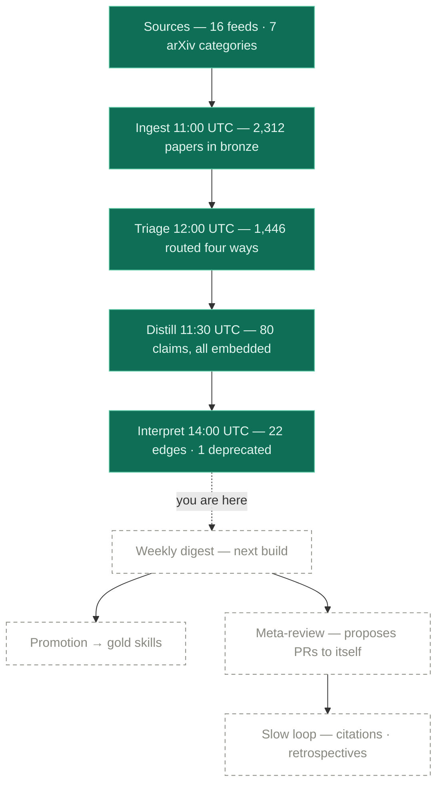
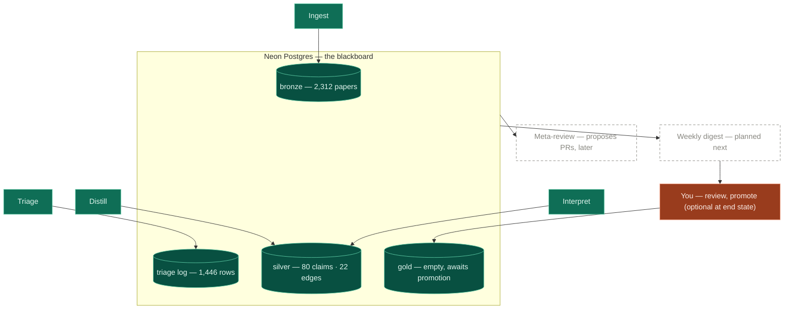
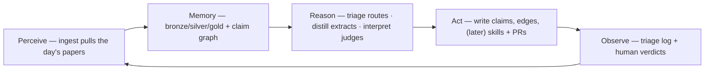

# Diagram atlas

Every architecture diagram in one place, rendered natively by GitHub. Diagrams
drawn in chat are ephemeral; these are the durable copies. Numbers in the
status diagram are a dated snapshot — the database is always the truth.

Companion diagrams elsewhere: the **logical view** and **deployment view** are
in the [README](../README.md); the **current vs. institutional stack** is in
[stack.md](stack.md); the **schema/ERD** is [schema.sql](../db/schema.sql)
itself.

## Pipeline status — snapshot 2026-09-08

Green = live and ran today. Dashed = left to build. The frontier sits between
the interpret worker and the weekly digest.

## The blackboard — workers around the shared database

No worker talks to another. Each reads its inbox as a SQL view over what has
not yet been done; state lives in Postgres, so any worker can die mid-run and
resume at the next cron.

## The agent loop, unrolled onto the pipeline

The classic perceive → memory → reason → act → observe loop is what the daily
pipeline *is*, spread across cron jobs:

