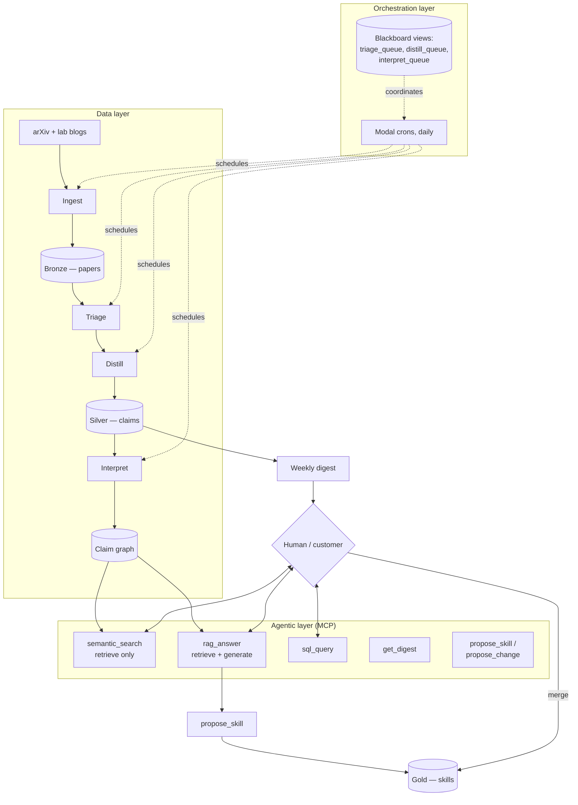

# The product pipeline: data layer to orchestration layer

Written for the owner, per the 2026-09-17 all-hands directive to the engineer
seat: "present, after research, a pipeline of our product all the way from
the data up to the engineering loops, including the orchestration layer,
harness engineering, loop engineering." This is that presentation. It also
carries the RAG explanation the same directive asked for, and points at the
sellable-product proposals in [docs/ideas.md](../ideas.md) that came out of
doing this research.

Companion reading: [docs/curriculum.md](../curriculum.md) teaches the same
layers as a course, mapped to where each was learned. This document reframes
the identical stack as a **product** — what's built, what's proposed, and
where the money is, per the differentiation the owner set on the record:
*"specifically technical, research, systems, directly applicable tools for
orchestration essentially"* — not AI news.

## 1. The pipeline today, as one diagram

Everything left of the orchestration box already runs, unattended, at $0/month
(ADR-2 through ADR-10). Everything in the agentic layer is the MCP server
(ADR-11); `rag_answer` is new this run (ADR-20, below).

## 2. Orchestration layer

**What it is, in plain terms:** the layer that decides *when* work happens,
*in what order*, and *what happens if a step fails partway* — as distinct
from the layer that decides *what the work means* (that's the agents, below
it) or *where knowledge lives* (that's the data layer, above it).

**What alexandria runs today:** four Modal crons on a fixed daily schedule,
coordinated by a **blackboard** — SQL views (`triage_queue`, `distill_queue`,
`interpret_queue`) that compute each worker's inbox as "what hasn't been done
yet," rather than by passing messages between workers (ADR-9). This is
deliberately the cheapest orchestration pattern that gives the properties
that matter: idempotency (running the same cron twice does no harm) and free
crash-resume (a rate-limited run stops mid-batch and the next cron picks up
exactly where it left off, because the state lives in the database, not in a
process). Distill is scheduled before triage on purpose, because they share
one free-tier token budget and distill is the higher-value spend — ordering
jobs by value-per-token is itself an orchestration decision, not just a cron
expression.

**What the industry means by "orchestration layer," and how it compares:**
IBM's 2026 AI operating model names four layers — agents, data, automation,
and hybrid infrastructure — with **watsonx Orchestrate** as the piece that
sits across them: a "multi-agent control plane" IBM describes as "a unifying
framework that integrates agents from multiple vendors," aimed at organizations
running agents from several different vendors and needing one place to
schedule, govern, and observe them all ([SiliconANGLE, May 2026][ibm-siliconangle];
[IBM Think 2026 recap][ibm-think]). That's the enterprise version of the same
problem alexandria solves in miniature: alexandria has one vendor (itself) and
four jobs, so blackboard-plus-cron is the right-sized answer; a company running
agents from five vendors across a thousand employees needs the heavier
control-plane version. Academic work on the same problem names it directly —
"Context Kubernetes" proposes declarative orchestration of enterprise
knowledge specifically for agentic AI systems ([arXiv:2604.11623][ck]), and a
2026 paper on event-driven multi-agent orchestration at enterprise scale
argues for the same shift alexandria already made — coordination by shared
state and events, not point-to-point calls ([arXiv:2606.20058][edmo]).

**The honest gap, per [stack.md](../stack.md):** cron-plus-blackboard has no
answer for *branching* workflows (retry this step three ways, escalate to a
human on the third failure) or for coordinating jobs across independent
schedules that need to negotiate, not just queue. That is exactly the job
**Temporal** (durable execution) or **Dagster** (partitioned, dependency-aware
scheduling) do at the institutional grade. Nothing here demands that upgrade
today — the queue-view pattern hasn't hit a wall yet — but it is the specific,
named next step, not "more infrastructure" in the abstract.

## 3. Harness engineering

**What it is, in plain terms:** everything that keeps a stochastic model
reliable and small-context, done *outside* the model, because the model
itself cannot be trusted to remember, to stay honest, or to fail gracefully.

**What alexandria runs today** (from [curriculum.md](../curriculum.md)):
the database holds state so no prompt has to; each step is small and stable
(route one batch, distill one paper, classify one candidate pair) instead of
one large prompt doing everything; JSON mode plus SQL `check` constraints
mean a hallucinated category cannot even be written to disk; retries honor
`Retry-After` because 429s are normal weather on a free tier, not an error
path; every judgment carries its model name and prompt hash so a bad output
is traceable to the exact prompt version that produced it.

**Why this is a product, not just plumbing:** every one of those five
disciplines is a thing *other* builders of agents need and mostly build badly
or not at all — badly-behaved retries, prompts with no version history,
LLM output written straight into columns with no constraint. A "harness
audit" — read someone else's agent, name which of these five disciplines it's
missing, hand back the fixes — is a sellable service that costs nothing new
to build because it's the same checklist alexandria already runs on itself.
See the ledger for the day-sized first step.

## 4. Loop engineering

**What it is, in plain terms:** deciding what repeats, on what clock, with
how much autonomy, and — the one decision that matters most — where the
human gate sits.

alexandria runs four loops today (unchanged from curriculum.md, restated here
because they're the product's actual shape):

1. **Fast loop (daily, zero agency):** ingest → distill → triage → interpret.
2. **Knowledge loop (continuous):** new claims judge older ones; deprecation
   is an emergent property of accumulated contradictions, not a rule.
3. **Human-gated loop (weekly):** the digest and skill promotion — concentrate
   the one human decision at the highest-leverage point instead of removing
   it.
4. **Recursive loop (weekly):** the meta-review reads its own record and
   proposes diffs to its own prompts, as pull requests only.

**The loop this run adds:** a fifth loop, on-demand rather than clocked — a
**question loop**. Someone (the weekly agent verifying the digest, or a paying
customer using the API) asks a question; `rag_answer` retrieves the relevant
claims and synthesizes a cited answer; the asker can follow every citation
back to a claim id and a paper. It has zero autonomy (it writes nothing) and
no clock (it runs when asked), which is exactly why it was cheap to add: it
composes the existing retrieval primitive with one new synthesis step, rather
than introducing new machinery.

## 5. RAG, explained plainly, and what changed today

The owner asked for RAG explained in plain language, and for RAG built for
real — both as a sellable capability and inside our own pipeline. Here is
the plain version, then what shipped.

**Semantic search** finds things. You ask a question, it hands you back the
most relevant raw material — here, the k nearest claims by meaning, each with
its evidence and source paper — and you read them yourself. That's what
`semantic_search` has always done. It's a librarian finding the right books
and putting them on the desk in front of you.

**RAG (retrieval-augmented generation)** answers things. It does the same
retrieval, then hands the retrieved material to a model and asks it to write
the answer, in prose, with citations back to exactly which retrieved item
supports which sentence. That's the librarian reading the books and telling
you the answer, with a footnote on every claim so you can check her work.
RAG is strictly retrieval-plus-one-more-step; without the retrieval step it's
just a model guessing from memory, which is the thing hallucination comes
from ([Meilisearch, semantic search vs. RAG][meili]).

**What alexandria already had:** `interpret` is retrieve-then-reason — every
new claim retrieves its 5 nearest older neighbors, and a model classifies the
relation. That's RAG's retrieval-then-generation shape, but the "generation"
is a one-word label (`supports` / `contradicts` / ...), not an answer a human
reads. It's RAG in miniature, not RAG as a product.

**What shipped this run (ADR-20):** a new MCP tool, `rag_answer`. It embeds
the question, retrieves the k nearest claims (reusing the exact same query
`semantic_search` uses), builds a numbered context block, and asks
`gpt-oss-120b` (the same free-tier model as triage/distill/interpret — no new
cost) to answer strictly from that context with inline `[C<id>]` citations,
governed by a new versioned prompt,
[prompts/rag-answer.md](../../prompts/rag-answer.md). The prompt is written
to refuse rather than fabricate when the corpus doesn't cover a question, and
to cite both sides when retrieved claims conflict rather than silently
picking one. The tool is used two ways starting now:

- **Self-used:** the weekly agent (`prompts/weekly-agent.md`) can call it
  while drafting the synthesis or verifying the digest, instead of reading
  raw `semantic_search` results itself.
- **Sellable:** it's the same tool a paying customer would call through a
  hosted "ask the corpus" surface — see the ledger proposal, which is the
  first day-sized step toward exposing this outside the MCP connector
  (auth, rate limits, and a synthesis-model upgrade for paying tiers are the
  open questions, deliberately not decided here).

**What this run did not build**, and why it's a ledger item instead: a
customer-facing hosted endpoint (needs auth and rate-limiting design), a
frontier-model synthesis tier for paying customers (needs a pricing decision
on the metered cost), and wiring `rag_answer` into the digest-drafting prompt
itself (needs the weekly agent's own charter to reference it, which is that
agent's call, not this PR's). All three are proposed in
[docs/ideas.md](../ideas.md) as day-sized first steps.

## 6. Sellable products beyond skills

Full proposals with triggers and first steps are in
[docs/ideas.md](../ideas.md); this is the map. Every one of these holds the
differentiation line from the all-hands: technical research and systems
intelligence, directly applicable orchestration tooling — never a news feed.

| Product | What it sells | Why it's not "just a skill" |
|---|---|---|
| Ask alexandria (RAG API) | Cited, corpus-grounded answers over API, metered | A skill is static text; this is a live query against a growing graph |
| Harness audit | A structured review of someone else's agent against the five-discipline checklist in §3 | Judgment applied to *their* system, not a file they read |
| Agent packs | A skill plus the activation prompt that drives the whole multi-step job, bundled and versioned | Higher price point than a skill file, same evidence-and-revision discipline |
| Claim graph API | Read access to `supports`/`refines`/`contradicts` edges as structured data, not prose | Sells the graph itself, not a document derived from it |

The market for the third row already exists and validates the price point:
skill marketplaces built on Anthropic's open Agent Skills spec now bundle "a
skill plus an activation prompt that drives a whole multi-step job" as a
distinct, higher-priced SKU (roughly $9 for a prompt pack up to $32 for an
"agent," against $3.99-$19 for a bare skill) ([Agentman, Agent Skills
Ecosystem Report 2026][agentman]). alexandria's edge in that market is
provenance: every one of our skills traces to specific claim ids and gets
revised or retired when the evidence changes; a marketplace skill is static
and unverified once bought. That's the concrete stealable-idea-versus-our-edge
pair from this run's competitive scan (full note in the ledger).

## 7. Scoreboard: built vs. proposed vs. researched-only

| Item | State |
|---|---|
| `rag_answer` MCP tool + prompt (ADR-20) | **Built**, this PR |
| Semantic-search-vs-RAG explanation | **Delivered**, §5 above |
| Orchestration layer research (IBM, arXiv) | **Delivered**, §2 above |
| Harness / loop engineering as sellable framing | **Delivered**, §3-4 above |
| Sellable products beyond skills | **Proposed**, ledger entries |
| Hosted RAG API (auth, billing) | **Proposed**, ledger, not built |
| Frontier-model synthesis tier | **Proposed**, ledger, needs a pricing call |
| Temporal/Dagster orchestration upgrade | **Researched only** — no evidence yet that the current pattern has hit its ceiling |

## Sources

- [IBM Think 2026 recap — managing agentic AI's speed, scale and sprawl][ibm-think]
- [SiliconANGLE — IBM charts AI operating model, May 2026][ibm-siliconangle]
- [Context Kubernetes: declarative orchestration of enterprise knowledge for agentic AI systems, arXiv:2604.11623][ck]
- [Autonomous event-driven multi-agent orchestration for enterprise AI at scale, arXiv:2606.20058][edmo]
- [Meilisearch — semantic search vs. RAG, a side-by-side comparison][meili]
- [Agentman — the Agent Skills ecosystem in 2026][agentman]

[ibm-think]: https://www.ibm.com/think/news/think-2026-ai-recap
[ibm-siliconangle]: https://siliconangle.com/2026/05/05/ibm-charts-ai-operating-model-move-enterprises-beyond-experimentation/
[ck]: https://arxiv.org/pdf/2604.11623
[edmo]: https://arxiv.org/pdf/2606.20058
[meili]: https://www.meilisearch.com/blog/semantic-search-vs-rag
[agentman]: https://agentman.ai/blog/agent-skills-ecosystem-report-2026
